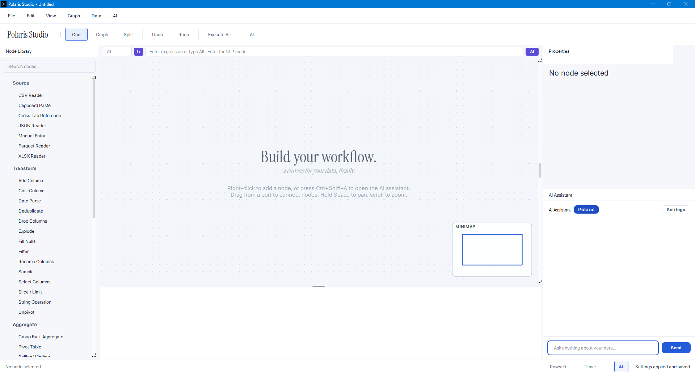

# Polaris Studio

Polaris Studio is a desktop app for working with data. You build a pipeline by drawing a graph: each step is a node, lines between them show the flow. Load a file, filter rows, join two tables, draw a chart. The app runs the graph and shows you the result in a spreadsheet.

There is also a built-in AI assistant. Tell it what you want in plain English, and it suggests the nodes and connections for you. You approve the plan before anything changes. The AI is optional. Everything else works without it.

Your data stays on your computer. There are no accounts, no telemetry, and no required cloud services. The only network call the app makes is to the AI provider, and only if you turn the AI on and add your own API key.



## What it can do

- Load CSV, Excel, Parquet, and JSON files. Paste from the clipboard.
- Transform data with visual nodes: filter, sort, rename, cast, fill, dedupe, parse dates, sample.
- Reshape with pivot, unpivot, group-by, and rolling windows.
- Join tables with inner, left, right, full, and anti joins.
- Make bar, line, scatter, histogram, box, and heatmap charts. (Experimental, in progress)
- Export the result back to CSV, Excel, Parquet, or JSON.
- Edit results in a live spreadsheet with sorting, frozen rows, and column statistics.
- Ask the AI to build or change the pipeline, then review each change before it runs.
- Save your work as a `.polaris` file and open it again later in the same state.

## Quick start

Install with pip and run:

```bash
git clone https://github.com/programmersd21/polaris_studio
cd polaris_studio
pip install -r requirements.txt
python src/polaris_studio/main.py
```

If you prefer an editable install (recommended for development):

```bash
pip install -e .
polaris-studio
```

**Requirements:** Python 3.11 or newer. Windows, macOS, and Linux are all supported.

> The first launch on Windows can be slow while Windows Defender scans the bundled Polars and PyArrow native libraries. This only happens once.

## What it looks like

When you open Polaris Studio, a short intro plays: the app icon and the name fade in centered on screen, hold for a moment, then settle into the top toolbar. You can turn this intro off in **Settings** under **Appearance** if you prefer to start straight at the workspace.

## Documentation

The full documentation is in the `docs/` folder.

### If you are new

- [Installation](docs/getting-started/installation.md) covers Windows, macOS, and Linux in detail.
- [10-minute quick tour](docs/getting-started/quick-tour.md) shows the main features in a few minutes.
- [Your first pipeline](docs/getting-started/first-pipeline.md) walks you through loading a file, filtering it, and making a chart.
- [Interface tour](docs/getting-started/interface-tour.md) explains every panel and button.
- [Keyboard shortcuts](docs/getting-started/keyboard-shortcuts.md) is a complete shortcut reference.

### If you want to use it for real work

- [Core concepts](docs/user-guide/concepts.md) explains nodes, connections, caching, and the difference between data and metadata.
- [The graph canvas](docs/user-guide/canvas.md) covers pan, zoom, selection, copying, and layout.
- [The panels](docs/user-guide/panels.md) describes every panel in the app.
- [The AI assistant](docs/user-guide/ai-panel.md) explains how the chat, preview cards, and approvals work.
- [The spreadsheet](docs/user-guide/spreadsheet.md) covers the live grid, formula bar, and column stats.
- [Charts](docs/user-guide/charts.md) covers the six chart types and how to export them.
- [Command palette](docs/user-guide/command-palette.md) covers the keyboard-first launcher (Ctrl+P).
- [Saving and preferences](docs/user-guide/saving-and-preferences.md) covers `.polaris` files, settings, and AI keys.

### If you need a specific node

- [Node reference](docs/nodes/reference.md) lists every node type, its parameters, and an example.

### If you are a developer

- [Developer setup](docs/developer/setup.md) covers the repo, dev install, and IDE config.
- [Testing](docs/developer/testing.md) covers pytest, mypy, and ruff.
- [Adding a new node type](docs/developer/adding-a-node.md) is the most common kind of contribution, and walks you through it end to end.
- [API reference](docs/developer/api-reference.md) lists the public classes and methods.

### If you want to understand how it works

- [Architecture overview](docs/architecture/overview.md) describes the layers and how data flows through them.
- [Graph engine](docs/architecture/graph-engine.md) covers the DAG, caching, and dirty propagation.
- [AI pipeline](docs/architecture/ai.md) covers the schema-validated commands and error recovery.
- [State management](docs/architecture/state.md) covers AppState, Workspace, and the undo/redo stack.
- [IPC layer](docs/architecture/ipc.md) covers the multi-process compute and Arrow transport.
- [Design system](docs/reference/design-system.md) covers typography, palette, and motion.

### If something is broken

- [Common issues](docs/troubleshooting/common-issues.md) covers fonts, AI keys, and slow startup.
- [FAQ](docs/troubleshooting/faq.md) is a short list of frequent questions.

## How it is built

| Part | What it is | Why |
|---|---|---|
| Engine | Polars on Apache Arrow | Fast columnar compute, predictable memory |
| Graph editor | PySide6 `QGraphicsView` | Hardware-accelerated, custom-rendered |
| Spreadsheet | Qt `QAbstractTableModel` | Virtualised rows, smooth scroll past a million rows |
| AI | Google Gemini (via official SDK) | Streaming, structured output, your own key |
| Compute | Multi-process worker | Heavy jobs do not block the UI |
| Transport | Arrow IPC + JSON | Zero-copy DataFrame handoff between processes |

## Project layout

```
polaris_studio/
├── src/polaris_studio/
│   ├── core/           # Headless engine: DAG, executor, node registry, profiler
│   ├── ipc/            # Multi-process compute: protocol + worker
│   ├── io/             # File handlers: CSV, Parquet, XLSX, clipboard
│   ├── agent/          # AI: schemas, interpreter, chat session, backend
│   ├── state/          # AppState, Workspace (multi-tab), HistoryStack
│   ├── ui/             # PySide6 widgets, panels, dialogs, graph view
│   ├── main.py         # CLI entry point
│   └── __main__.py     # GUI entry point
├── assets/theme.qss    # Global stylesheet
├── fonts/              # Bundled Inter, Outfit, Instrument Serif, JetBrains Mono
├── tests/              # pytest tests
└── docs/               # The full documentation
```

## Development

```bash
pip install -e ".[dev]"
pytest                    # run the test suite
mypy .                    # type check
ruff check src/           # lint
```

See [Developer setup](docs/developer/setup.md) for the full guide.

## Contributing

Bug reports, feature requests, and pull requests are welcome. Read [CONTRIBUTING.md](CONTRIBUTING.md) for the workflow.

## License

MIT. Free to use, modify, and distribute.
